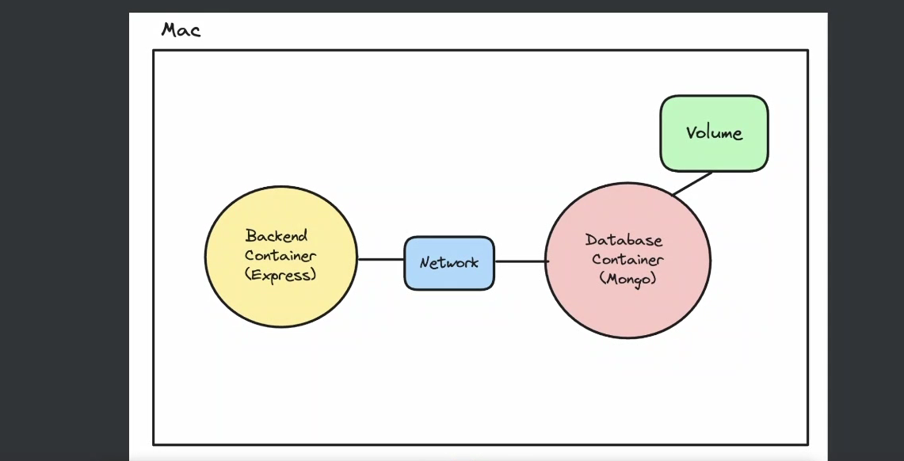
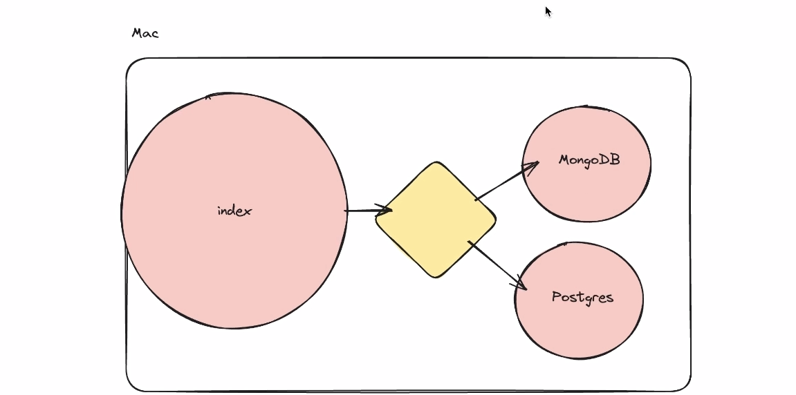

# Docker Overview and Concepts

## Container
A container is like a miniature isolated machine within our root machine. It encapsulates an application along with its dependencies, providing a consistent environment for running software across different computing environments.

## Containerization
Containerization is a technology that enables the packaging of applications and their dependencies into standardized units called containers. Docker is a popular containerization platform that provides tools for building, shipping, and running containers.

### Why Containerization?
Containerization offers several benefits:
- **Isolated Environment**: Running processes in an isolated environment ensures that applications do not interfere with each other.
- **Simplified Local Development**: Starting projects and auxiliary services locally becomes a breeze, as containers encapsulate all dependencies and configurations.
- **Kubernetes/Container Orchestration**: Containerization plays a crucial role in modern orchestration tools like Kubernetes, facilitating scalable and efficient management of containerized applications.

### Inside Docker

- **Docker CLI**: Docker Command-Line Interface allows users to interact with the Docker engine, managing containers, images, networks, and volumes.
- **Docker Engine**: The Docker Engine is the core component of Docker, responsible for creating and running containers on the host system.
- **Docker Registry**: Docker Registry is a repository where popular images are stored and can be accessed. It serves as a centralized location for sharing and distributing container images.

### Images vs Containers
- **Images**: Images are standalone, executable, and self-sufficient packages containing everything needed to run a project, including its dependencies and configurations.
- **Containers**: Containers are running instances of images in isolated environments, providing a consistent execution environment for applications.

## Layers and Layer Changes

- **Layered Filesystem**: Docker images use a layered filesystem to capture changes incrementally.
- **Copy-on-Write**: Layer changes are managed through a copy-on-write strategy, storing only differences.
- **Layer Caching**: Docker optimizes image builds by caching unchanged layers for reuse.
- **Command Order**: The order of commands in a Dockerfile impacts layer caching efficiency, with volatile commands ideally placed last.

 
## Networks & Volumes

These components are crucial for Docker container management:

### Volumes
- Preserve data across container restarts.
- Facilitate data sharing between containers or with the host machine.

### Networks
- Enable seamless communication between containers.
- Note: Each container operates within its own network, separate from the host's network.






## Development vs. Production Stages

Dockerfiles can define distinct stages for development and production environments. This allows for different dependencies and configurations based on the deployment stage.

 
## Dockerfile (Example)
This Dockerfile example demonstrates a multi-stage build for a Node.js application. It starts with a base stage, installing dependencies and adding nano as a development tool. Then, it splits into development and production stages, copying the application code and defining the appropriate commands for each environment.

### Dockerfile Example

```Dockerfile
FROM mhart/alpine-node as base
WORKDIR /usr/src/app
COPY package*.json ./
RUN npm install

# Install nano
RUN apk --no-cache add nano

FROM base AS development
COPY . .
CMD ["npm", "run", "dev"]

FROM base AS production
COPY . .
RUN npm prune --production
CMD ["npm", "run", "start"]


# Dockerfile (Example)
## Build Development Image
docker build --target development -t anas1005/demo-repo:dev .

## Build Production Image
docker build --target production -t anas1005/demo-repo:prod .

## Create Network
docker network create nw1

# #Create Volume
docker volume create vol1

## Run MongoDB Container
docker run -v vol1:/data/db --name mongo1 --network nw1 -p 27017:27017 mongo

## Run Application Container
docker run -p 3000:3000 -v .:/usr/src/app --name back1 --network nw1 anas1005/demo-repo:dev


## Docker Compose

Docker Compose is a tool for defining and running multi-container Docker applications. It simplifies the management of interconnected services, ensuring consistent environments and easy scalability.

### Example:
```yaml
version: '3.8'
services:
  backend1:
    build:
      context: .
      target: development
    ports:
      - "3000:3000"
    volumes:
      - .:/usr/src/app
    depends_on:
      - mongo1

  mongo1:
    image: mongo:latest
    volumes:
      - vol1:/data/db

volumes:
  vol1:
