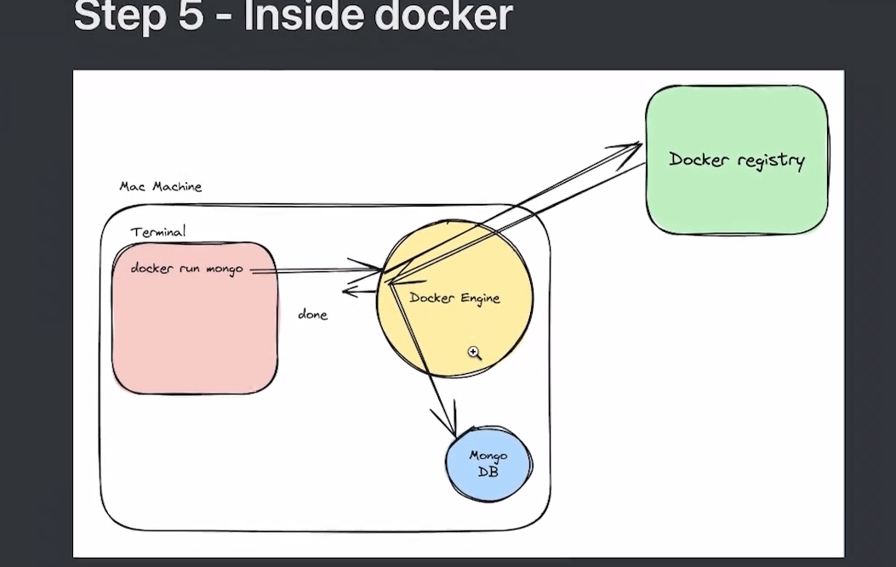

# Docker Overview and Concepts

## Container
A container is like a miniature isolated machine within our root machine. It encapsulates an application along with its dependencies, providing a consistent environment for running software across different computing environments.

## Containerization
Containerization is a technology that enables the packaging of applications and their dependencies into standardized units called containers. Docker is a popular containerization platform that provides tools for building, shipping, and running containers.

### Why Containerization?
Containerization offers several benefits:
- **Isolated Environment**: Running processes in an isolated environment ensures that applications do not interfere with each other.
- **Simplified Local Development**: Starting projects and auxiliary services locally becomes a breeze, as containers encapsulate all dependencies and configurations.
- **Kubernetes/Container Orchestration**: Containerization plays a crucial role in modern orchestration tools like Kubernetes, facilitating scalable and efficient management of containerized applications.

### Inside Docker

- **Docker CLI**: Docker Command-Line Interface allows users to interact with the Docker engine, managing containers, images, networks, and volumes.
- **Docker Engine**: The Docker Engine is the core component of Docker, responsible for creating and running containers on the host system.
- **Docker Registry**: Docker Registry is a repository where popular images are stored and can be accessed. It serves as a centralized location for sharing and distributing container images.

### Images vs Containers
- **Images**: Images are standalone, executable, and self-sufficient packages containing everything needed to run a project, including its dependencies and configurations.
- **Containers**: Containers are running instances of images in isolated environments, providing a consistent execution environment for applications.

### Layers and Layer Changes

- **Layered Filesystem**: Docker images use a layered filesystem to capture changes incrementally.
- **Copy-on-Write**: Layer changes are managed through a copy-on-write strategy, storing only differences.
- **Layer Caching**: Docker optimizes image builds by caching unchanged layers for reuse.
- **Command Order**: The order of commands in a Dockerfile impacts layer caching efficiency, with volatile commands ideally placed last.

 


## Development vs. Production Stages

Dockerfiles can define distinct stages for development and production environments. This allows for different dependencies and configurations based on the deployment stage.

## Docker Commands

Docker commands are used to manage Docker images and containers. They automate the deployment and scaling of applications, making it easier to manage complex software environments.

### Example:
- `docker build`: Builds a Docker image from a Dockerfile.
- `docker run`: Creates and runs a Docker container based on a specified image.
- `docker network`: Manages Docker networks, allowing containers to communicate with each other.
- `docker volume`: Manages Docker volumes, providing persistent storage for containers.

## Docker Compose

Docker Compose is a tool for defining and running multi-container Docker applications. It simplifies the management of interconnected services, ensuring consistent environments and easy scalability.

### Example:
```yaml
version: '3.8'
services:
  backend1:
    build:
      context: .
      target: development
    ports:
      - "3000:3000"
    volumes:
      - .:/usr/src/app
    depends_on:
      - mongo1

  mongo1:
    image: mongo:latest
    volumes:
      - vol1:/data/db

volumes:
  vol1:
